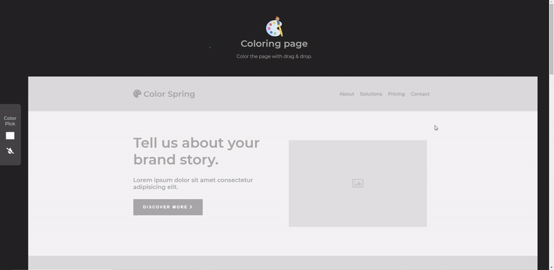
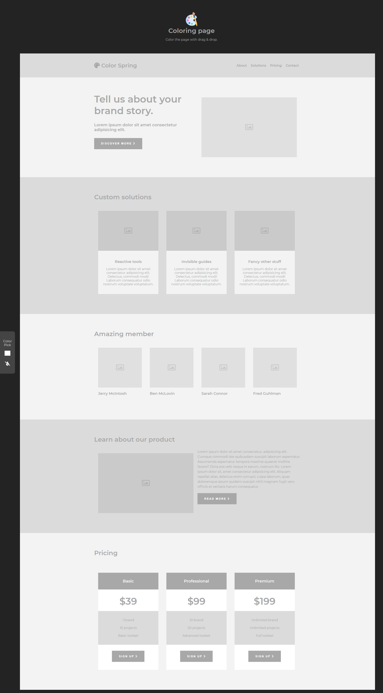
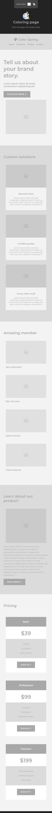

# Coloring Page

⭐완성된 Coloring Page : https://yuuujin97.github.io/Coloring-Page/

---

## Coloring Page란

사용자가 원하는 색상을 선택한 후 색상을 드래그하여 섹션 또는 텍스트에 색상을 지정하는 사이트입니다.

사용 방법으로는 왼쪽에 있는 Color Pick 영역에 네모 상자를 이용하여 원하는 색상을 선택한 후 그 색상을 끌어서 섹션 또는 텍스트 요소 위로 올리게 되면 보라색 윤곽선이 켜진 영역에 놓을 수 있습니다.

Color Pick 영역 맨 밑에 있는 물방울 모양을 누르게 되면 전체 영역을 초기화할 수 있습니다.

---

### 📑보완해야 할 점

1. ~~사용자가 원하는 색상을 선택하게 변경~~

   > 2021.09.19
   >
   > 기존 지정된 색상으로 구성되어 있던 팔레트 부분을 없애고 사용자가 원하는 색상을 선택할 수 있게 변경함

2. ~~모바일 환경에서도 Drag and Drop 동작이 가능하게 변경~~

   > 2021.09.25
   >
   > 기존의 코드로는 모바일 환경에서 Drag and Drop 기능이 동작하지 않아, 방법을 찾던 중 Drag and Drop, resizing 등등 다양한 기능을 지원하는 라이브러리를 찾아 사용하게 되어 PC, Mobile에서 Drag and Drop 동작이 가능하도록 변경함

   📚사용한 라이브러리 : https://interactjs.io/

---

### 구현된 기능

- 반응형 웹 디자인 추가
- 마우스 hover 상태 추가
- 원하는 색상 선택
- 섹션 또는 텍스트 색상 변경
- 전체 영역 초기화

### Built with

- Semantic HTML5 markup
- CSS custom properties
- Sass / Scss Modules
- JavaScript
- Flexbox

### Screenshot

Desktop ver.

Mobile ver.

